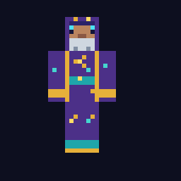

# MC Wizard

A Bedrock-first spike for an AI Minecraft teacher that can answer questions from versioned sources and act as an all-capable Wizard in a trusted private family world.

The intended vertical slice is:

```text
iPad / Bedrock chat
  → official Bedrock Dedicated Server
  → MC Wizard behavior pack
  → visible MC Wizard SimulatedPlayer (an official Player subclass)
  → local HTTP brain
  → Bedrock RAG + optional external model
  → typed Minecraft, player, world, or server action
  → MC Wizard walks, looks, chats, holds, and places the approved blocks
```

Status: the Node brain, persistent bounded dialogue sessions, provider bridge, versioned RAG promotion, Apple-container BDS, behavior/resource packs, embodied `SimulatedPlayer`, safe typed plans, transaction rollback/undo, and isolated headless world runner are implemented. The physical 334-action calculator acceptance run is intentionally slow because the Wizard navigates within reach and uses an inventory item for every placement. BDS 1.26.33.2 still does not toggle a copper bulb's `lit` state through the synthetic pulse, so that one interaction remains an iPad acceptance check.

Ask `wizard, build me something that changes every time I press a button` and the brain returns a kid-friendly explanation, cites the retrieved material, and emits the typed action for a Bedrock copper-bulb T flip-flop. The visible MC Wizard is designed to walk to the demonstration site and place the approved blocks once the BDS prerequisite above is available.

## What is here

- A dependency-free Node HTTP service with authentication, input limits, timeouts, and an offline mode.
- Local retrieval over self-authored mechanic cards plus cached official documentation.
- A sync job for the [Microsoft Minecraft Creator documentation](https://github.com/MicrosoftDocs/minecraft-creator) and separate [stable](https://feedback.minecraft.net/hc/en-us/sections/360001186971-Release-Changelogs) / [preview](https://feedback.minecraft.net/hc/en-us/sections/360001185332) changelogs.
- OpenAI Responses API support and an OpenAI-compatible Chat Completions mode for other providers.
- A current Bedrock 26.30+ behavior pack using `@minecraft/server`, `@minecraft/server-gametest`, `@minecraft/server-net`, and `@minecraft/server-admin`.
- A visible, server-created MC Wizard based on Bedrock's official [`SimulatedPlayer`](https://learn.microsoft.com/en-us/minecraft/creator/scriptapi/minecraft/server-gametest/simulatedplayer?view=minecraft-bedrock-experimental), which extends `Player` and can walk, look, chat, hold items, and perform player block interactions.
- Embodied build actions for arbitrary bounded structures, houses, recipe displays, farms, common redstone machines, a copper-bulb T flip-flop, and a two-bit calculator.
- A safe action boundary: model prose cannot become commands or JavaScript. Fixed skills and bounded validated build plans are the only executable output.
- A loopback-only operator desk for live AI tuning, health, Bedrock console commands, logs, and browser-based dialogue tests.
- Journaled snapshots, rollback on failure/disconnect/restart, recent-build protection, and `wizard undo`.
- A pack installer that preserves other activated packs, plus an original importable classic Wizard skin pack.

## Run the brain

Requires Node 22.9 or newer.

```bash
cp .env.example .env
npm install
npm run hooks:install
npm test
npm run eval:live-chat
npm start
```

For the prepared local stack, one supervisor owns the provider bridge, brain, and Bedrock container with bounded restart backoff:

```bash
npm run wizard:start
npm run wizard:status
npm run wizard:stop
```

Status reports only service health, provider name, and corpus size; it does not print tokens, prompts, player identifiers, or credentials.

### Operator desk

`npm run wizard:start` also ensures the local operator desk is running. It can be managed independently without stopping Bedrock:

```bash
npm run admin:start
npm run admin:status
npm run admin:stop
```

Open [http://127.0.0.1:3001](http://127.0.0.1:3001) on the server Mac. The desk provides:

- live Bedrock, brain, and provider health;
- quick world controls plus a one-line Bedrock console input;
- recent container logs that refresh every four seconds and follow new output automatically;
- a live, persistent interaction history with Wizard/general questions, answers, action labels, and verified outcomes;
- a separate browser dialogue session for testing Wizard and general AI replies; and
- hot-loaded prompt addenda, AI enable/disable, and output-token limits.

### Live-chat refinement loop

Do not tune the Wizard from a remembered paraphrase. Inspect the latest local chat/session log and label each turn `success`, `partial`, or `failure`. Promote a live turn into the public `test/fixtures/live-chat-regressions.json` only with parent or guardian opt-in, after manually removing names, gamertags, contact/location details, school information, and other identifying text. Prefer a synthetic equivalent that preserves the exact typo or follow-up pattern which triggered the bug. Run `npm run eval:live-chat` before and after a fix.

The brain also appends pseudonymized local JSONL records to ignored `runtime/brain/interactions.jsonl`; set `INTERACTION_LOG_FILE` to override the path. The file is mode `0600` and automatically retains only its newest 2 MiB. Player names are HMAC-pseudonymized and removed from recorded text, but free-form chat can still contain personal information and must not be treated as anonymized. The operator desk polls the same history, so a tester can inspect the request, reply, chosen action, and executor result without relaying it by hand.

AI tuning is stored in ignored `runtime/admin/settings.json` and read on every request, so saving it does not restart Bedrock or the brain. The base safety, action, and book-format contracts remain in code. Console input uses the image's documented [`send-command`](https://github.com/itzg/docker-minecraft-bedrock-server#executing-server-commands) helper without invoking a shell.

The desk intentionally binds only to loopback. It is not available to iPads or other LAN devices. Change that only after adding authentication and TLS.

Commits are issue-driven. The tracked `commit-msg` hook rejects messages without a reference to an existing issue in this repository. Use a message such as `Improve dialogue sessions (Refs #8)`.

In a second terminal:

```bash
npm run ask -- "Build me something that changes every time I press a button"
```

With no AI configuration, the service uses deterministic offline answers backed by the retrieved cards. This makes the bridge and build path testable without spending money or exposing a key.

### Connect an AI

For OpenAI, set these in `.env`:

```dotenv
AI_STYLE=responses
AI_API_KEY=your-key
AI_MODEL=gpt-5.6-luna
```

[`gpt-5.6-luna`](https://developers.openai.com/api/docs/guides/latest-model) is the current efficient GPT-5.6 variant; the model is configuration, not architecture. For an OpenAI-compatible provider such as OpenRouter or a local server:

```dotenv
AI_STYLE=chat
AI_BASE_URL=https://provider.example/v1
AI_API_KEY=your-key-if-required
AI_MODEL=provider-model-id
```

The service sends the question, retrieved excerpts, recent dialogue, and a bounded live-world snapshot—including Minecraft coordinates, nearby block/entity summaries, and current project geometry—to the configured provider. It does not send the player's gamertag; the name is used only to derive a per-install HMAC `safety_identifier` for OpenAI.

For the local subscription-backed bridge used by this spike, start this first:

```bash
npm run start:ai
```

`mtok-bridge` provides the OpenAI-compatible transport. Its upstream can be the authenticated local Codex, Grok, or Claude CLI. Codex runs ephemerally with native web search in a read-only sandbox; user configuration, rules, apps, multi-agent, and shell tools are disabled. Grok runs single-turn with memory, subagents, web search, and tools disabled; Claude uses safe mode, an empty tool list, and no session persistence. The provider receives only the model prompt: it cannot act in Minecraft. The loopback bridge rejects browser-originated and non-JSON requests. It runs three provider jobs by default (bounded to 2–4), bounds queue waits, and terminates the active CLI immediately when a player disconnects or the request times out. Then start the brain with `npm start`.

Greetings, readiness checks, thanks, jokes, calculator builds, T flip-flops, and small castle gates run as immediate local skills without an AI request. Deeper questions use the cached corpus as evidence for the configured model to synthesize; raw documentation is never used as a chat fallback. Every provider action is checked against the child's explicit intent before it can reach Bedrock, and an unrelated provider goal cannot attach itself to ordinary conversation. Build requests create a persisted goal with observable success criteria. If an unusual shape cannot be planned after the bounded repair attempt, the Wizard places a clearly described footprint-and-height layout as useful progress and automatically continues the same goal; it never labels that layout as the finished object. A completed placement batch is only an observation: Bedrock returns a fresh world snapshot, the goal reviewer either marks the goal complete or issues the next related correction, and at most six automatic actions can run before the Wizard explicitly asks the child to inspect the still-active project. New child requests supersede older planning and late provider replies atomically. The Bedrock log message `Running AutoCompaction...` is database maintenance, not an AI request; the operator desk hides those routine lines and reports that they use zero AI tokens.

Unfamiliar build requests explicitly require the Codex planner to research current Bedrock mechanics before returning one executable action. It may cross-check official documentation, community guides, and accessible video descriptions or transcripts, but it must synthesize rather than dump sources and must distinguish Bedrock from Java. The unfamiliar request wording is sent to the configured provider and may be used by its web-search feature. Research-derived plans are restricted to reusable construction capabilities, so web content cannot directly produce server-console, server-configuration, or arbitrary-command actions; explicit player requests still retain the trusted-family server authority described below. When a completed build receives a grade of 4 or 5 without a requested correction, its validated relative action is stored in ignored `runtime/brain/learned-recipes.json` and can be reused for equivalent wording without another model call. A low grade or correction removes a reused recipe and enters the existing same-project refinement loop; only the later successful version can be promoted. Recipe records contain no player identity and are bounded by `LEARNED_RECIPES_MAX` (default 100).

In game, `ai <question>` always means this general model route. It requires the `ai` keyword even when the player is alone or beside the Wizard, skips Minecraft RAG and Wizard actions, and prefixes short replies with the configured provider label, such as `[ChatGPT]`. Replies over 700 characters are placed in a signed book at the player's feet. Ordinary chat and `wiz`/`wizard` continue through the Minecraft-specialist route.

## Load official knowledge

```bash
npm run sync:docs
```

This command:

1. shallow-clones or updates `MicrosoftDocs/minecraft-creator` under ignored `.cache/`;
2. caches stable and preview changelogs into separate directories;
3. builds a staged stable/preview Bedrock release with revision, version, attribution, and content hashes;
4. resolves safe JSON source transclusions so vanilla mob behavior is indexed instead of empty code placeholders;
5. runs retrieval and dialogue smoke evaluations, including player-facing cat taming;
6. atomically promotes the staged release only if every evaluation passes.

It requires Git and internet access. The first sync downloads roughly 8,800 repository files plus 712 changelog articles. The resulting `.cache/` is intentionally ignored: this workspace currently indexes 31,703 chunks, but a fresh clone must run `npm run sync:docs` to recreate that corpus. Before syncing, only the six authored mechanic cards are available.

Normal retrieval excludes preview and Java-only material unless the question explicitly says preview, beta, or experimental. Current docs and tested mechanic cards rank above patch notes for ordinary mechanics questions. Microsoft Creator documentation is an add-on/developer corpus, not a complete gameplay encyclopedia; curated player-facing cards provide instant verified answers for high-value topics, while the configured model may answer stable common gameplay facts when retrieval is incomplete. Issue #16 tracks the broader versioned gameplay knowledge graph. The spike uses a small exact-term/TF-IDF-style in-memory index until retrieval evals justify the persistent graph/vector layer.

Microsoft's repository licenses documentation under CC BY 4.0 and code samples under MIT. Preserve attribution and revision URLs. Changelog content has no explicit open-content license, so keep that cache private and return links rather than redistributing a corpus.

## Run with Bedrock

The correct base is the official Bedrock Dedicated Server, not a Java bridge or a reimplementation of the changing Bedrock protocol. Microsoft officially supports BDS on Windows and Ubuntu, not macOS.

The behavior pack uses beta chat, HTTP, and [`@minecraft/server-gametest`](https://learn.microsoft.com/en-us/minecraft/creator/scriptapi/minecraft/server-gametest/minecraft-server-gametest?view=minecraft-bedrock-experimental) APIs. The world must have the **Beta APIs** experiment enabled before moving it to BDS; there is no supported server property that turns this experiment on afterward. Pin the BDS and API versions after the first passing in-world test because beta APIs can change between releases.

### The embodied wizard

When a real player joins, the behavior pack is set up to spawn one `MC Wizard` near that player. This is a server-side `SimulatedPlayer`, not a custom mob wearing a player-shaped model: it is an actual subclass of Bedrock's `Player`. It uses the normal player rendering path and can navigate, turn to look at a child, speak under its own name, carry selected items, and place or interact with blocks as a player.

The embodiment does not need a second Xbox/Microsoft account. It requires a Beta-APIs-enabled world and the pre-release GameTest Script API. The original Astral Workshop Wizard skin is a standard 64x64 classic-arm skin under `bedrock/skin_packs/mc_wizard`; it intentionally replaces the old fake hat-and-robe shell. Run `npm run package:skin` to create `dist/mc-wizard-skin.mcpack` for Bedrock's Classic Skins picker.

Bedrock's Script API cannot pass classic PNG pixels to `SimulatedPlayer.setSkin`; its documented `PlayerSkinData` contains only Character Creator pieces, arm size, and skin color. The required world resource pack therefore uses the official player render path to map only the exact `MC Wizard` name to Astral Workshop Wizard. Every other player continues through `Texture.default`, preserving their own selected skin. The pack version is bumped when this path changes; the standalone installer and managed local starts both refresh the world's pack assignment and enforce `texturepack-required=true`, including for worlds initialized by older builds. The checked-in `player.entity.json` is based on Mojang's current Bedrock sample and must be refreshed when the pinned Bedrock minor version changes.

After a server restart, reconnect from an iPad and confirm the resource-pack download, Astral Workshop skin, normal walking/holding animations, and the child's own unchanged skin. `wiz, copy my skin` remains a diagnostic for Character Creator data; it is not the classic-skin installation path.



Address the character in chat:

- `wizard, <question or request>` asks a knowledge or build question.
- `wizard, copy my skin` lets an operator test copying their current Character Creator look to MC Wizard.
- `wizard, come here` asks MC Wizard to walk to the speaker and face them.
- `wizard, stay` stops its current movement.

The movement commands control only the embodied character. In trusted-family mode the model can also compose physical builds, any Minecraft command, dedicated-server console commands, server properties, experiments, and world options. It still cannot execute arbitrary host JavaScript or shell commands.

Addressed chat is the reliable interaction in this slice. Bedrock may not show a touch `Interact` action for another Player, even a simulated one, so tapping the body is an explicit iPad acceptance test rather than a promised control path.

### Existing Windows or Ubuntu BDS

1. Create a Bedrock world with Beta APIs enabled, activate/export it, and copy it into BDS.
2. Run BDS once. Confirm the world folder exists and `level-name` matches it exactly.
3. Start the brain with `npm start`.
4. Install and activate the pack:

   ```bash
   npm run install:pack -- "/path/to/bedrock-server" "World Folder" "http://127.0.0.1:3000/v1/ask"
   ```

5. Restart BDS. Connect an iPad to the server machine's LAN IP on UDP port `19132`.
6. Confirm MC Wizard appears nearby, then type `wizard, come here`, `wizard, how does a T flip-flop work?`, or `wizard, build a T flip flop for me`.

`BRIDGE_TOKEN` in `.env` is also used by the installer. Change the development token before the service is reachable by anything beyond your own machine.

### macOS development route: Apple container

Apple container 1.1.0 is installed and verified on this Mac. It runs one lightweight Linux VM per OCI container. The pinned third-party [`itzg/minecraft-bedrock-server`](https://github.com/itzg/docker-minecraft-bedrock-server) amd64 image runs Microsoft's x86-64 BDS through [Apple container's Rosetta path](https://github.com/apple/container/blob/main/docs/how-to.md#build-and-run-a-multiplatform-image). This avoids the native heap faults observed with the image's arm64/Box64 wrapper, but it is still not a Mojang-supported macOS host.

Install the current signed Apple container 1.1.0 package deliberately rather than piping an installer into a shell:

```bash
curl -L -o /tmp/container-1.1.0-installer-signed.pkg \
  https://github.com/apple/container/releases/download/1.1.0/container-1.1.0-installer-signed.pkg
echo "0ca1c42a2269c2557efb1d82b1b38ac553e6a3a3da1b1179c439bcee1e7d6714  /tmp/container-1.1.0-installer-signed.pkg" \
  | shasum -a 256 -c -
pkgutil --check-signature /tmp/container-1.1.0-installer-signed.pkg
open /tmp/container-1.1.0-installer-signed.pkg
```

After reviewing/installing it:

```bash
container system start
container system version
container system status
```

Then:

1. Either put an exported Beta-APIs-enabled world at `runtime/bedrock/worlds/mc-wizard`, or create a disposable fresh one headlessly with `npm run bootstrap:bds`. The bootstrap container publishes no network port, stops BDS cleanly, backs up `level.dat`, structurally enables the three official Beta API experiment bytes, and deletes only its temporary container.
2. Choose the Mac's private LAN IPv4 first. Copy `.env.example` to `.env`, set `HOST` to that literal address (not `0.0.0.0`), replace `BRIDGE_TOKEN` with at least 24 random characters, and run `npm start`. Leave `WIZARD_SALT` blank to derive a private stable salt from that token, or set it to a different random secret of at least 24 characters. The brain refuses to bind beyond loopback with a default or short token and ignores the old public salt placeholder.
3. Supply the Mac's private LAN IPv4:

   ```bash
   export MC_WIZARD_LAN_IP=192.168.x.x
   ```

4. Activate/configure the behavior pack while BDS is stopped, then launch the pinned image/BDS version:

   ```bash
   npm run install:pack -- runtime/bedrock mc-wizard \
     "http://${MC_WIZARD_LAN_IP}:3000/v1/ask"
   npm run container:bds
   npm run container:logs
   ```

5. Add the server manually on each iPad using the Mac LAN IPv4 and UDP port `19132`; LAN discovery broadcasts may not cross the container VM. Do not forward this port on the router for the spike.

Approve the macOS Local Network/incoming-connections prompt if it appears. In the logs, wait for both `IPv4 supported, port: 19132` and `Server started.` before joining. Open-LAN mode still requires Microsoft authentication, binds only to the Mac's exact RFC1918 address, and must not be forwarded on the router. Anyone who can reach that private network can join until the container is stopped.

Stop BDS cleanly with `npm run container:stop`; later starts use `npm run container:start`. That managed start refreshes both packs, their world-version assignments, and the required client-pack setting before starting the existing container. After any configuration change: stop BDS, update `.env`, restart the brain, then use the managed start. If the LAN bind, access mode, image digest, or BDS `VERSION` changed, run `npm run container:delete` and then `npm run container:bds`. Deleting the container does not delete the bind-mounted world in `runtime/bedrock`.

The launcher refuses an address that is not a private IPv4 assigned to this Mac or a missing world. This experimental family build is intentionally open to authenticated players on the private LAN and gives new players operator permission. It pins both the OCI image digest and BDS 1.26.33.2 so a restart cannot silently cross a beta-API boundary. `compose.yaml` remains a Docker-compatible alternative, but Apple container is the prepared macOS route.

### Required iPad/BDS acceptance checks

None of these in-world checks has passed yet. The first live run must record whether:

- an iPad sees the MC Wizard body, held item, movement, head direction, name tag, and authored chat;
- tapping or using MC Wizard produces a usable interaction on the Bedrock touch client;
- MC Wizard appears correctly in the iPad player list and the BDS `/list` output;
- the locator bar or player-waypoint UI treats MC Wizard as expected;
- death, disconnect, and a BDS restart recover to exactly one MC Wizard rather than zero or duplicates;
- MC Wizard affects the advertised player count or `max-players` limit, including when a second child joins; and
- `come here`, `stay`, and an actual block placement remain synchronized and do not trigger the wizard's own chat listener.

Player-list, locator, touch-interaction, restart, and player-count behavior are deliberately acceptance checks rather than claims: the Script API documents the `Player` subclass and its actions, but not every client UI and dedicated-server lifecycle consequence.

### Headless in-world acceptance

The pack can run its real chat-to-build path without an Xbox login. With the brain already running, the isolated one-command test is:

```bash
npm run test:e2e:bds
```

For a shorter live acceptance focused only on the three common redstone machines:

```bash
npm run test:e2e:machines
```

That run has Test Kid close and reopen the 2x2 piston door, waits for the automatic smelter to deliver an iron ingot, and confirms the item sorter sends a diamond and a feather to different output chests. It checks real blocks, inventories, hopper directions, and redstone movement rather than chat text.

Focused runs cover the open-ended child experience without rerunning the whole suite:

```bash
npm run test:e2e:arbitrary
npm run test:e2e:portal
npm run test:e2e:travel-rollback
npm run test:e2e:city
npm run test:e2e:child
npm run test:e2e:refinement
npm run test:e2e:farms
npm run test:e2e:kelp
```

The arbitrary run verifies an unusual exact-size structure rather than a canned prototype. The child run verifies a sized house, an in-place castle upgrade, working chicken, wool, and naturally harvested kelp farms, bounded splash-potion rain, contextual time and weather, physical item delivery, and an in-world recipe lesson. The refinement run keeps rooms, villagers, a balcony, enlargement, and a moat on the same castle. The farm run requires fresh sugar cane, bamboo, and cactus growth to reach the output chest; the kelp run isolates the same natural-growth-to-chest proof for its observer/piston circuit.

It bootstraps a fresh Beta-APIs world under a unique `runtime/e2e/<run-id>` data root, launches a unique Apple container with no published port, and always stops/deletes that container. A passing world is deleted; a failing world is retained for diagnosis. Raw BDS output is saved to ignored `runtime/e2e-last.log`.

The test creates a disposable pad away from spawn and spawns a uniquely named Test Kid as a second official `SimulatedPlayer`. Test Kid first attempts each request with `SimulatedPlayer.chat`. If BDS does not surface that call through `world.beforeEvents.chatSend`, the harness detects the missing event after ten ticks and invokes the exact same addressed-message parser/router directly. Every run reports `engine-event` or `direct-harness-fallback`, so a passing build test never falsely claims that simulated chat reached the engine listener. It then checks the wizard's five-part T flip-flop, asks for the two-bit calculator, and verifies one real Test Kid lever raycast. Because BDS eventually ignores repeated SimulatedPlayer lever clicks, the isolated fixture removes those four levers and Test Kid physically places or breaks redstone blocks at the exact input positions while all 16 electrical sums are read from the output lamps. It emits one correlated `MC_WIZARD_E2E` PASS/FAIL record and disconnects. Real iPad chat always uses the engine listener; the direct chat route exists only inside the gated headless harness.

## Bridge contract

The behavior pack calls:

```http
POST /v1/ask
Authorization: Bearer <BRIDGE_TOKEN>
Content-Type: application/json

{"player":"BuilderKid","question":"build a t flip flop","mode":"wizard"}
```

The explicit general route sends `"mode":"general"`; that response always has `"kind":"general"`, no sources, and no action.

The brain returns prose, provenance, a persisted goal, and an optional typed action:

```json
{
  "answer": "A T flip-flop stores one bit...",
  "goal": {
    "objective": "Build a working T flip-flop nearby",
    "successCriteria": "Each button press toggles the output and the lamp shows its state",
    "status": "active"
  },
  "action": {
    "type": "place_blueprint",
    "id": "copper_bulb_t_flip_flop",
    "version": 1
  },
  "sources": [
    {
      "title": "Copper bulb T flip-flop",
      "url": "https://feedback.minecraft.net/...",
      "version": "1.21+",
      "channel": "stable"
    }
  ],
  "mode": "offline"
}
```

The Bedrock adapter accepts only registered, versioned actions and validates every material, dimension, coordinate, interaction, entity, and operation bound before execution. It reports `started`, `completed`, or `failed` back to `/v1/action-result`; completed results include a bounded live-world snapshot for semantic goal review. Structure and machine corrections retain immutable goal lineage and the prior project location, and unrelated replacement actions are rejected.

## Why this differs from the reference bot

[`danshorstein/minecraft-ai-bot`](https://github.com/danshorstein/minecraft-ai-bot) is an MIT-licensed Java/Paper companion built around Mineflayer, a large prompt cookbook, OpenRouter tool calls, and OP slash commands. Its strongest transferable idea is its continuous goal runner: plan once, execute a step, scan the world, ask an independent QA role whether the criteria pass, and continue at a fixed anchor. It also relies on deterministic city/castle skills and a broad raw-command escape hatch; it is not a RAG or Minecraft-documentation system.

Mineflayer, Paper setup, Java NBT/commands, and raw OP command execution do not transfer to Bedrock. The reference character is visible, but its large builds are performed by `/fill`, `/setblock`, and `/summon`, with extra crew players used theatrically. MC Wizard keeps the structured-skill and iterative-QA ideas, uses Bedrock's official beta `SimulatedPlayer` for the visible character, and puts actions behind a strict Script API compiler. It does not log in a headless protocol client or hold credentials for a second Xbox account. No source code from the reference project is copied here.

## Known limits of this spike

- The live iPad test verified the visible player entity, chat, AI books, and basic mechanics. The custom wand and T-flip-flop's real-client copper-bulb transition still need a quick iPad visual check. The fitted costume was removed after testing because it obscured the player model.
- The T flip-flop, calculator, command lessons, and validated plans are transactional and undoable. They require bounded clear areas, reject occupied/protected overlaps, and roll back on failure or disconnect.
- The current documented Script API cannot safely program arbitrary command-block text. Prepared lesson definitions make the Wizard physically place the command block and button, then tell the child exactly what to paste; they deliberately do not `/structure load` a prebuilt result.
- The simulated player attempts normal placement and interaction first. Large surfaces use bounded fill operations, and a rejected Bedrock placement can be repaired directly after visible player attempts; therefore the current runtime does not guarantee that every final block was accepted through the player-placement API.
- Goal QA observes validated plans, project memory, nearby blocks/entities, weather, time, and action-specific acceptance results. It is not visual scene understanding yet. Automatic continuation is capped at six actions under one immutable goal; the goal stays active and the Wizard asks for child feedback rather than silently claiming success at the cap.
- Official Microsoft documentation is not a complete gameplay encyclopedia. Fill gaps with versioned, self-authored mechanic cards backed by reproducible Bedrock tests. Do not ingest the community wiki by default without accepting its attribution, noncommercial, and share-alike requirements.
- The operator desk is not a parental-control or child-chat-audit system. Dialogue sessions are bounded and stored under hashed player keys for continuity and regression promotion, but there is no retention/consent policy, per-world protected region, semantic cache, embedding index, or broad retrieval evaluation set yet.

## License

MC Wizard is released under the [MIT License](./LICENSE). Microsoft Minecraft documentation retains its original licensing and attribution requirements; cached documentation is not committed here.

## Next proof points

1. Complete the remaining iPad visual checks for the wand and real-client copper-bulb transition.
2. Add richer project-region observation—or a visual QA model—without exposing arbitrary world commands.
3. Prefer a direct provider API for the primary runtime; keep local CLI providers as subscription-backed fallbacks.
4. Add a scheduled world-backup restore drill for the explicitly open private-LAN server.
5. Expand the evaluated mechanic-card catalog and build a retrieval eval set from real child questions before broadening the block allowlist or adding embeddings.
6. Replace or separately license the calculator geometry before commercial distribution.
